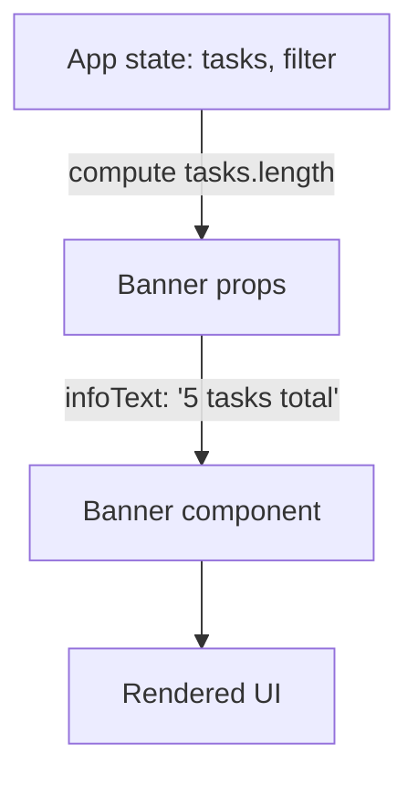
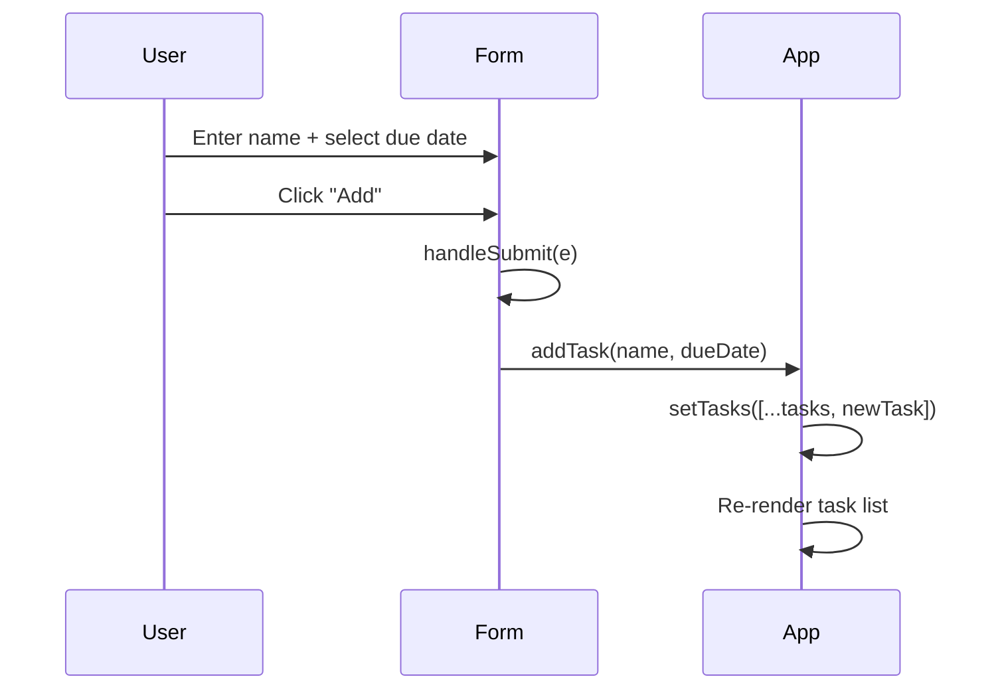
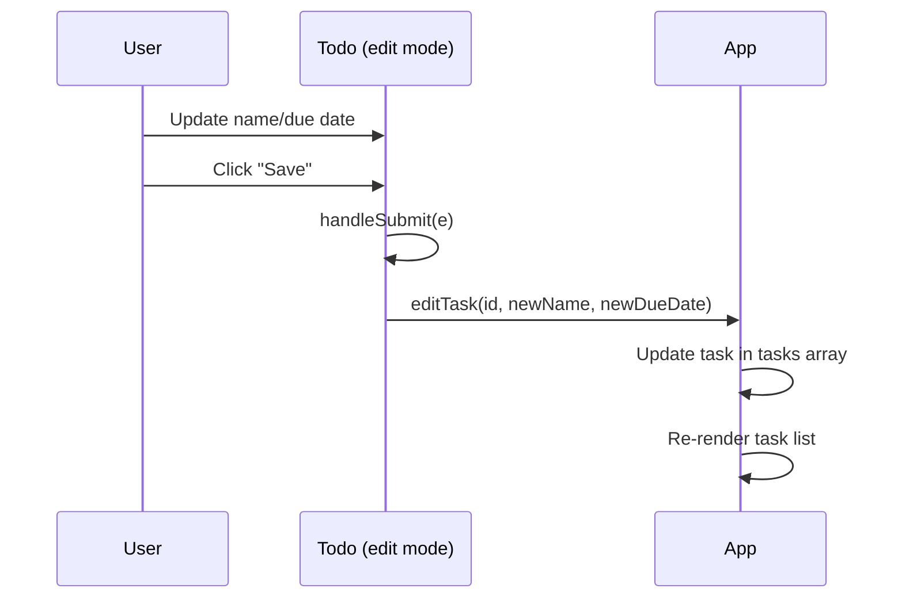
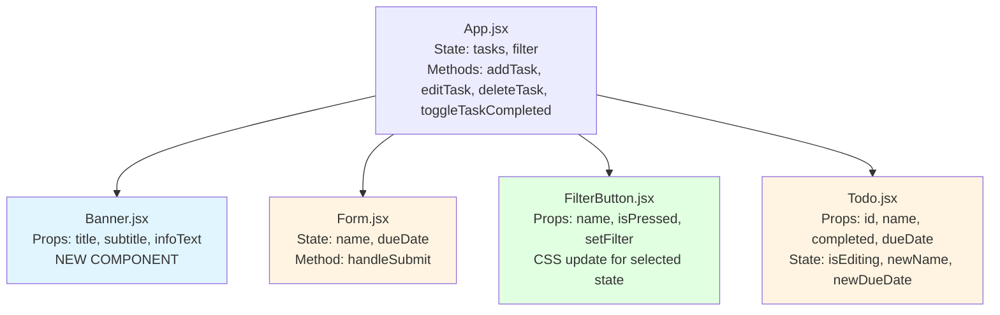

# Architecture Design: TodoMatic Enhancements

**Version:** 1.0  
**Date:** 2026-02-06  
**Status:** Proposed

---

## 1. Feature Summary

This design addresses three production requirements for TodoMatic:
- **PRD-001**: Improve button styling with distinct visual states for primary/destructive actions and clear filter selection.
- **PRD-002**: Add a top banner showing app title, subtitle, and one quick info item (task count, current filter, or today's date).
- **PRD-003**: Add optional due dates to tasks with input during creation, display in task items, and edit capability.

**Who**: End users of TodoMatic demo (students, workshop participants).  
**Why**: Enhance visual polish for demos, improve UX clarity, and add basic task scheduling capability.

---

## 2. UI/UX Behavior

### PRD-001: Button Styling
**User sees:**
- "Add" and "Save" buttons have a consistent primary color (e.g., blue).
- "Delete" buttons are visually distinct (e.g., red/danger color).
- Filter buttons show a clear selected state (e.g., bold border or darker background) when `aria-pressed="true"`.
- All buttons display a visible hover state (e.g., slightly darker shade).

**Empty/Error states:** No impact; this is purely visual styling.

---

### PRD-002: Top Banner
**User sees:**
- A banner region at the top of the app (above the "TodoMatic" heading).
- Banner contains: 
  - App title: "TodoMatic"
  - Subtitle: "React + Vite demo"
  - One info item (recommended: task count like "5 tasks total").

**Layout:** 
- Banner spans full width of `.todoapp` container.
- Info item aligns right (or center if simpler).

**Empty state:** Info shows "0 tasks total" when no tasks exist.

---

### PRD-003: Due Date Field
**User workflow:**
1. **Add task:** User enters task name and optionally selects a due date from a date input field. Submitting creates the task with `dueDate: "YYYY-MM-DD"` or `dueDate: null`.
2. **View task:** Task item displays due date as "Due: Feb 4, 2026" below the task name (if set). No text shown if `dueDate` is `null`.
3. **Edit task:** Editing mode shows both name and due date inputs. User can update or clear the due date.

**Empty state:** If no due date is set, the view template shows nothing extra.

**Error state:** No validation required beyond standard HTML date input constraints.

---

## 3. Data Model

### Current Task Shape
```javascript
{
  id: "todo-abc123",
  name: "Buy groceries",
  completed: false
}
```

### Updated Task Shape (PRD-003)
```javascript
{
  id: "todo-abc123",
  name: "Buy groceries",
  completed: false,
  dueDate: "2026-02-10" // ISO 8601 date string or null
}
```

**Migration strategy:** Existing tasks without `dueDate` will default to `null` (handled gracefully in UI).

### Example Tasks
```javascript
[
  {
    id: "todo-1",
    name: "Prepare workshop slides",
    completed: false,
    dueDate: "2026-02-08"
  },
  {
    id: "todo-2",
    name: "Review code samples",
    completed: true,
    dueDate: null
  }
]
```

---

## 4. Component Impact Map

| Component | PRD-001 | PRD-002 | PRD-003 | Change Type |
|-----------|---------|---------|---------|-------------|
| [src/index.css](../src/index.css) | ✅ | ✅ | - | Add/modify CSS classes for button styles and banner |
| [src/App.jsx](../src/App.jsx) | - | ✅ | ✅ | Add `<Banner>`, update `addTask()` to accept `dueDate`, update `editTask()` signature |
| [src/components/Form.jsx](../src/components/Form.jsx) | - | - | ✅ | Add date input field, update state and submission logic |
| [src/components/Todo.jsx](../src/components/Todo.jsx) | - | - | ✅ | Display due date in view template; add date input in edit template; update `handleSubmit()` |
| [src/components/FilterButton.jsx](../src/components/FilterButton.jsx) | ✅ | - | - | Add conditional class based on `isPressed` prop |
| **[src/components/Banner.jsx](../src/components/Banner.jsx)** | - | ✅ | - | **New component** (accepts title, subtitle, infoText props) |

---

## 5. State & Data Flow

### PRD-001: No State Changes
Button styling is CSS-only; no new React state required.

### PRD-002: Banner Component
- **State location:** `App.jsx` (already has `tasks` and `filter` state).
- **Data flow:**
  - `App` computes total task count: `tasks.length`.
  - `App` passes `title`, `subtitle`, and `infoText` as props to `<Banner>`.
  - Banner is a presentational component (no local state).

**Flow diagram:**


### PRD-003: Due Date Flow

**Add Task:**


**Edit Task:**


**State updates:**
- `addTask(name, dueDate)` creates task with both fields.
- `editTask(id, newName, newDueDate)` updates both fields.
- `Todo` component receives `dueDate` prop alongside `name`, `completed`, etc.

---

## 6. Component Diagram



---

## 7. Non-Functional Requirements (NFR)

### Accessibility
- **PRD-001**: Ensure button hover/focus states meet WCAG contrast requirements (4.5:1 for normal text).
- **PRD-002**: Banner text must be semantic HTML (use `<header>` or `<div role="banner">`). Info text should have `aria-live="polite"` if it updates dynamically.
- **PRD-003**: Date inputs must have proper `<label>` elements. Screen readers must announce due dates (consider `aria-label` or visually hidden text like "Due date: Feb 4, 2026").

### Performance
- **PRD-001**: CSS-only; no impact.
- **PRD-002**: Banner is static (re-renders with App, but no expensive computations).
- **PRD-003**: Adding one field per task has negligible impact. Use controlled inputs (existing pattern) to avoid unnecessary re-renders.

### Security/Privacy
- **PRD-001**: No concerns.
- **PRD-002**: Do not display sensitive info in banner (task count is safe).
- **PRD-003**: Due dates are user-visible local data. No sanitization needed for `<input type="date">` (browser-controlled). If displaying formatted dates, use browser's `Intl.DateTimeFormat` or simple string formatting (no user-provided HTML).

### Maintainability
- **PRD-001**: Keep button styles in [src/index.css](../src/index.css) using consistent class names (`.btn__primary`, `.btn__danger`, `.toggle-btn--selected`).
- **PRD-002**: Extract Banner into a separate component for reusability.
- **PRD-003**: Update task type definition (if using TypeScript in future) to include `dueDate?: string | null`. Use a helper function (e.g., `formatDueDate(dateString)`) to avoid duplicating date formatting logic.

---

## 8. Implementation Steps

### Phase 1: MVP (Demo-Ready)

#### Step 1: PRD-001 — Button Styling (CSS-only)
1. In [src/index.css](../src/index.css), add/update classes:
   - `.btn__primary`: blue background, white text.
   - `.btn__danger`: red background, white text.
   - `.toggle-btn[aria-pressed="true"]`: bold border or darker background.
   - `.btn:hover`: slightly darker shade for all buttons.
2. In [src/components/FilterButton.jsx](../src/components/FilterButton.jsx), add conditional class:
   ```jsx
   className={`btn toggle-btn ${props.isPressed ? 'toggle-btn--selected' : ''}`}
   ```
3. Verify existing `className="btn btn__primary"` in [src/components/Form.jsx](../src/components/Form.jsx) and [src/components/Todo.jsx](../src/components/Todo.jsx) (Save button).
4. Verify existing `className="btn btn__danger"` in [src/components/Todo.jsx](../src/components/Todo.jsx) (Delete button).

---

#### Step 2: PRD-002 — Top Banner
1. Create [src/components/Banner.jsx](../src/components/Banner.jsx):
   ```jsx
   function Banner({ title, subtitle, infoText }) {
     return (
       <div className="banner">
         <div className="banner__content">
           <h1 className="banner__title">{title}</h1>
           <p className="banner__subtitle">{subtitle}</p>
         </div>
         <div className="banner__info">{infoText}</div>
       </div>
     );
   }
   export default Banner;
   ```
2. In [src/App.jsx](../src/App.jsx):
   - Import `Banner`.
   - Compute `const totalTasksText = \`${tasks.length} tasks total\`;`.
   - Render `<Banner title="TodoMatic" subtitle="React + Vite demo" infoText={totalTasksText} />` before existing `<h1>TodoMatic</h1>`.
   - Remove or keep the existing `<h1>TodoMatic</h1>` depending on desired layout (recommend removing to avoid duplication).
3. In [src/index.css](../src/index.css), add banner styles:
   ```css
   .banner {
     display: flex;
     justify-content: space-between;
     align-items: center;
     padding: 1rem 0;
     border-bottom: 2px solid #ddd;
     margin-bottom: 2rem;
   }
   .banner__title {
     font-size: 3rem;
     margin: 0;
   }
   .banner__subtitle {
     font-size: 1.2rem;
     color: #666;
     margin: 0;
   }
   .banner__info {
     font-size: 1.4rem;
     font-weight: bold;
   }
   ```

---

#### Step 3: PRD-003 — Due Date Field (Data Model + Form)
1. In [src/components/Form.jsx](../src/components/Form.jsx):
   - Add state: `const [dueDate, setDueDate] = useState('');`.
   - Add date input field after the name input:
     ```jsx
     <label htmlFor="new-todo-duedate">Due Date (optional)</label>
     <input
       type="date"
       id="new-todo-duedate"
       value={dueDate}
       onChange={(e) => setDueDate(e.target.value)}
     />
     ```
   - Update `handleSubmit` to call `props.addTask(name, dueDate || null)`.
   - Reset `dueDate` in `handleSubmit`: `setDueDate('');`.
2. In [src/App.jsx](../src/App.jsx):
   - Update `addTask(name, dueDate)` signature.
   - Update task creation:
     ```javascript
     const newTask = {
       id: "todo-" + nanoid(),
       name: name,
       completed: false,
       dueDate: dueDate || null
     };
     ```
3. In [src/App.jsx](../src/App.jsx), pass `dueDate` to `<Todo>`:
   ```jsx
   <Todo
     id={task.id}
     name={task.name}
     completed={task.completed}
     dueDate={task.dueDate}
     key={task.id}
     ...
   />
   ```

---

#### Step 4: PRD-003 — Display & Edit Due Date (Todo Component)
1. In [src/components/Todo.jsx](../src/components/Todo.jsx):
   - Add state: `const [newDueDate, setNewDueDate] = useState('');`.
   - Update `viewTemplate` to display due date:
     ```jsx
     {props.dueDate && <p className="todo-duedate">Due: {formatDate(props.dueDate)}</p>}
     ```
   - Create helper function (at top of file or in utils):
     ```javascript
     function formatDate(isoString) {
       if (!isoString) return '';
       const date = new Date(isoString);
       return date.toLocaleDateString('en-US', { month: 'short', day: 'numeric', year: 'numeric' });
     }
     ```
   - Update `editingTemplate` to include date input:
     ```jsx
     <label htmlFor={`${props.id}-duedate`}>Due Date</label>
     <input
       type="date"
       id={`${props.id}-duedate`}
       value={newDueDate}
       onChange={(e) => setNewDueDate(e.target.value)}
     />
     ```
   - Update `handleSubmit` to call `props.editTask(props.id, newName, newDueDate || null)`.
   - Initialize `newDueDate` when entering edit mode (add to `setEditing(true)` logic or `useEffect`):
     ```javascript
     useEffect(() => {
       if (!wasEditing && isEditing) {
         setNewName(props.name);
         setNewDueDate(props.dueDate || '');
         editFieldRef.current.focus();
       }
     }, [isEditing, wasEditing, props.name, props.dueDate]);
     ```
2. In [src/App.jsx](../src/App.jsx):
   - Update `editTask(id, newName, newDueDate)` signature.
   - Update task editing logic:
     ```javascript
     return { ...task, name: newName, dueDate: newDueDate };
     ```

---

#### Step 5: Styling & Polish
1. In [src/index.css](../src/index.css), add styles for due date display:
   ```css
   .todo-duedate {
     font-size: 1.2rem;
     color: #666;
     margin: 0.5rem 0 0 2.5rem; /* Indent to align with checkbox label */
   }
   ```
2. Test all button hover states and filter selection in browser.
3. Verify date inputs work correctly on create and edit flows.

---

#### Step 6: Verification
1. Run `yarn lint` and fix any issues.
2. Run `yarn build` to ensure production build succeeds.
3. Run `yarn preview` and manually test:
   - Add task with/without due date.
   - Edit task to add/update/remove due date.
   - Verify filter buttons show selected state.
   - Verify "Add", "Save", "Delete" buttons have correct colors.
   - Verify banner displays task count and updates when tasks are added/removed.
4. Test keyboard navigation and screen reader announcements (basic check).

---

### Phase 2: Optional Enhancements (Post-Demo)

These are **out of scope** for the current PRD but could be considered later:
- Add due date sorting (show overdue tasks first).
- Highlight overdue tasks in red.
- Add a "Clear completed" button.
- Persist tasks to `localStorage` (see AGENTS.md for storage patterns).

---

## 9. Open Questions & Decisions

| Question | Decision | Rationale |
|----------|----------|-----------|
| Should we keep the existing `<h1>TodoMatic</h1>` in App.jsx? | Remove it; use Banner title only | Avoids duplication and gives banner more prominence |
| Which info item for the banner? | Task count ("5 tasks total") | Most useful for users; filter name is redundant with filter buttons; today's date is less relevant |
| Date format for display? | "Feb 4, 2026" (localized short format) | Friendly and concise; uses browser's `toLocaleDateString()` |
| Should empty due date show placeholder text? | No | Per PRD: "no placeholder text" keeps UI clean |
| Do we need date validation (e.g., no past dates)? | No | Keep it simple; HTML date input prevents invalid formats |

---

## 10. Risks & Mitigations

| Risk | Impact | Mitigation |
|------|--------|------------|
| Breaking existing tests (if added later) | Medium | Add tests for new props/methods after implementation |
| Date input browser compatibility | Low | `<input type="date">` is widely supported (IE11 excluded, but not a target for Vite/React apps) |
| Over-engineering banner | Low | Keep Banner as a simple presentational component; avoid adding dynamic behavior |
| Forgetting to update `editTask` signature everywhere | Medium | Use grep to find all `editTask` calls before testing |

---

## 11. Success Criteria

✅ **PRD-001**: All buttons have distinct hover states; primary/danger actions are visually clear; filter selection is obvious.  
✅ **PRD-002**: Banner displays title, subtitle, and task count; updates when tasks change.  
✅ **PRD-003**: Users can add/edit due dates; dates display in task items; empty due dates are handled gracefully.  
✅ `yarn lint` passes.  
✅ `yarn build` succeeds.  
✅ Manual smoke test in `yarn preview` covers all flows.

---

## 12. Handoff Notes for Implementation

**For the developer:**
- Start with PRD-001 (easiest; CSS-only).
- Then PRD-002 (new component, no state complexity).
- Then PRD-003 (most complex; requires updating multiple components and methods).
- Use `git commit` after each PRD is complete to create incremental checkpoints.
- If you encounter issues with focus management after adding due date fields, revisit the `useEffect` hooks in [src/components/Todo.jsx](../src/components/Todo.jsx).

**Dependencies:**
- No new npm packages required (uses existing nanoid, React, Vite).

**Estimated effort:**
- PRD-001: 30 minutes (CSS updates + testing).
- PRD-002: 45 minutes (new component + integration + styling).
- PRD-003: 90 minutes (form updates + Todo updates + App updates + testing).
- **Total: ~2.5 hours** (includes testing and polish).
